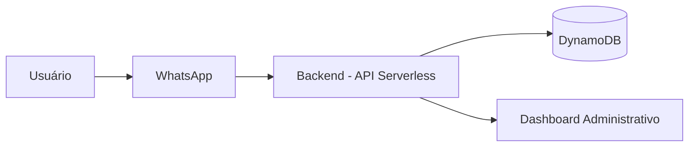
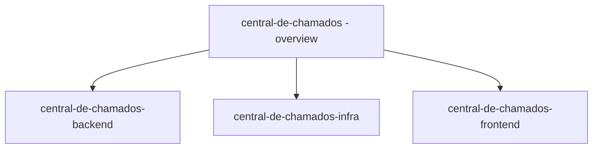

# Central de Chamados

### Arquitetura End-to-End para Estruturação de Atendimento via WhatsApp

---

## 📌 Visão Geral

A **Central de Chamados** é um projeto end-to-end que resolve um problema operacional real:

> Pequenas operações que utilizam WhatsApp como canal principal de atendimento não possuem estrutura formal de gestão.

O projeto foi concebido, modelado e implementado com foco em:

- Definição clara do problema  
- Análise de requisitos baseada em operação real  
- Modelagem orientada a domínio  
- Decisões arquiteturais com trade-offs explícitos  
- Preparação para produção  
- Evolução para camada de inteligência (AI-ready)  

Este repositório é o **overview arquitetural do sistema** e conecta os demais componentes.

---

## 🎯 Problema Real

Assistências técnicas e pequenas operações de serviço utilizam o WhatsApp para:

- Orçamentos  
- Aprovação de serviços  
- Atualizações  
- Reclamações  
- Pós-venda  

O WhatsApp resolve comunicação.

Não resolve gestão.

Com o crescimento do volume, surgem falhas estruturais:

- Chamados esquecidos  
- Falta de histórico organizado  
- Status implícito  
- Dependência da memória do proprietário  
- Dificuldade de escalar  

O gargalo é estrutural, não tecnológico.

---

## 📊 Impacto Esperado

Hipóteses que o sistema busca validar em produção:

- Redução do tempo médio de resposta  
- Redução de retrabalho  
- Redução de chamados esquecidos  
- Maior previsibilidade operacional  
- Menor dependência do proprietário  

O projeto é orientado a impacto mensurável.

---

## 🏗 Arquitetura Geral

### Modelo Arquitetural

- SaaS Multi-Tenant  
- Serverless  
- API-First  
- Orientado a Domínio  
- Escalável horizontalmente  
- Preparado para camada de AI  

### Diagrama Conceitual

---

## 🧱 Componentes do Sistema

### 🔹 Backend (Principal ativo técnico)

Responsável por:

- Modelagem de domínio  
- Estruturação de chamados  
- Controle de status  
- Histórico persistente  
- Isolamento multi-tenant  
- Segurança e autenticação  
- Versionamento de API  
- Idempotência  

Repositório:  
`central-de-chamados-backend`

---

### 🔹 Infraestrutura / DevOps

Responsável por:

- Provisionamento com Terraform  
- Ambientes (dev / staging / prod)  
- Deploy serverless  
- Segurança e políticas  
- Observabilidade  
- CI/CD  
- Controle de custos  

Repositório:  
`central-de-chamados-infra`

---

### 🔹 Frontend (Dashboard)

Responsável por:

- Visualização de chamados  
- Gestão de status  
- Interface administrativa  
- Integração com API  

Repositório:  
`central-de-chamados-frontend`

---

## 🧠 Decisões Arquiteturais

### 1. Serverless

Escolha por AWS Lambda + API Gateway:

- Escalabilidade automática  
- Modelo pay-per-use  
- Redução de custo ocioso  
- Simplicidade operacional inicial  

Trade-off:
- Complexidade maior em observabilidade e cold starts  

---

### 2. DynamoDB + Single Table Design

Escolha orientada por:

- Padrões reais de consulta  
- Performance previsível  
- Baixa latência  
- Escala horizontal nativa  

Trade-off:
- Modelagem inicial mais complexa  
- Necessidade de disciplina nas chaves e índices  

---

### 3. Multi-Tenancy por `company_id`

- Isolamento lógico  
- Segurança aplicada desde o MVP  
- Preparado para expansão sem reestruturação  

---

## 🔐 Considerações de Produção

O projeto considera desde o início:

- Segurança multi-tenant  
- Versionamento de API  
- Idempotência em operações críticas  
- Estrutura preparada para logs estruturados  
- Métricas por tenant  
- Monitoramento de performance  

Não é um projeto acadêmico.

É projetado para sobreviver em produção.

---

## 🤖 AI-Ready Architecture

A arquitetura permite evolução para camada de inteligência aplicada ao atendimento.

Possíveis extensões:

- Classificação automática de mensagens  
- Extração de intenção  
- Sugestão de resposta assistida  
- Sumário automático de histórico  
- Detecção de risco de atraso  
- Identificação de padrões operacionais  

O core foi desenhado para suportar essa camada sem reestruturação do banco.

---

## 👤 ICP (Validação Inicial)

Segmento inicial:

- Assistências técnicas de celular  
- Assistências de informática  

Perfil:

- 1–5 operadores  
- 10–40 atendimentos diários  
- Baixa formalização de processo  
- Dependência operacional do WhatsApp  

A arquitetura não é limitada ao nicho inicial.

---

## 🚀 Objetivo Estratégico

Demonstrar capacidade de:

- Resolver problema real  
- Modelar domínio com clareza  
- Tomar decisões arquiteturais conscientes  
- Trabalhar com infraestrutura como código  
- Construir sistema escalável e observável  
- Projetar software preparado para evolução com AI  

---

## 📌 Status

Em desenvolvimento ativo.

Foco atual:

- Consolidação do backend  
- Estrutura multi-tenant robusta  
- Infraestrutura automatizada  
- Preparação para métricas operacionais  

---

### Estrutura de Repositórios

---

## 📎 Conclusão

A Central de Chamados é uma arquitetura moderna para estruturar atendimento via WhatsApp em pequenas operações de serviço.

O projeto combina:

- Engenharia de backend  
- Infraestrutura como código  
- Arquitetura serverless  
- Multi-tenancy  
- Preparação para inteligência aplicada  

Mais do que um sistema, é um exercício completo de engenharia aplicada ao mundo real.
