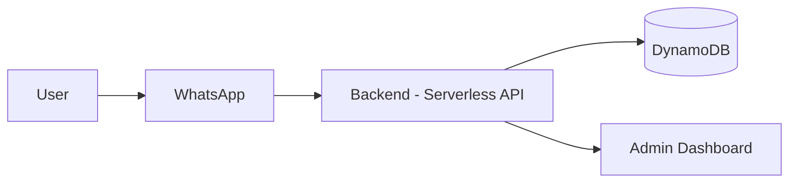
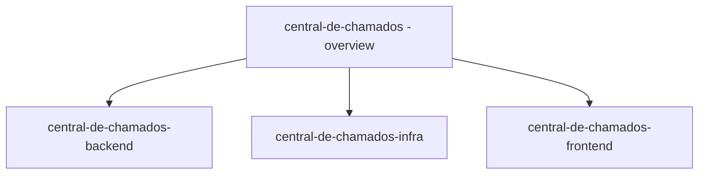

**Language:** 🇺🇸 English | [🇧🇷 Português](./README.pt-br.md)

# Central de Chamados

### End-to-End Architecture for Structuring Customer Support via WhatsApp

---

## 📌 Overview

**Central de Chamados** is an end-to-end project designed to solve a real operational problem:

> Small service operations that rely on WhatsApp as their primary support channel lack formal management structure.

The project was conceived, modeled, and implemented with focus on:

- Clear problem definition  
- Requirements analysis based on real operations  
- Domain-driven modeling  
- Architectural decisions with explicit trade-offs  
- Production readiness  
- Evolution toward an intelligence layer (AI-ready)  

This repository represents the **architectural overview of the system** and connects all other components.

---

## 🎯 Real-World Problem

Technical assistance shops and small service operations use WhatsApp for:

- Quotes  
- Service approvals  
- Updates  
- Complaints  
- After-sales support  

WhatsApp solves communication.

It does not solve management.

As volume grows, structural failures emerge:

- Forgotten service tickets  
- Lack of organized history  
- Implicit status tracking  
- Dependency on the owner’s memory  
- Difficulty scaling  

The bottleneck is structural — not technological.

---

## 📊 Expected Impact

Hypotheses the system aims to validate in production:

- Reduction in average response time  
- Reduction in rework  
- Fewer forgotten tickets  
- Greater operational predictability  
- Less dependency on the business owner  

The project is impact-oriented and measurable.

---

## 🏗 Overall Architecture

### Architectural Model

- Multi-Tenant SaaS  
- Serverless  
- API-First  
- Domain-Oriented  
- Horizontally scalable  
- AI-layer ready  

### Conceptual Diagram

## 🧱 System Components

### 🔹 Backend (Primary Technical Asset)

Responsible for:

- Domain modeling  
- Ticket structuring  
- Status control  
- Persistent history  
- Multi-tenant isolation  
- Security and authentication  
- API versioning  
- Idempotency  

Repository:  
`central-de-chamados-backend`

---

### 🔹 Infrastructure / DevOps

Responsible for:

- Provisioning with Terraform  
- Environments (dev / staging / prod)  
- Serverless deployment  
- Security and policies  
- Observability  
- CI/CD  
- Cost control  

Repository:  
`central-de-chamados-infra`

---

### 🔹 Frontend (Dashboard)

Responsible for:

- Ticket visualization  
- Status management  
- Administrative interface  
- API integration  

Repository:  
`central-de-chamados-frontend`

---

## 🧠 Architectural Decisions

### 1. Serverless

Choice: AWS Lambda + API Gateway

- Automatic scalability  
- Pay-per-use model  
- Reduced idle costs  
- Operational simplicity at early stage  

Trade-off:
- Increased complexity in observability and cold starts  

---

### 2. DynamoDB + Single Table Design

Chosen based on:

- Real access patterns  
- Predictable performance  
- Low latency  
- Native horizontal scalability  

Trade-off:
- Higher initial modeling complexity  
- Requires strict discipline in key and index design  

---

### 3. Multi-Tenancy via `company_id`

- Logical isolation  
- Security applied from MVP stage  
- Prepared for expansion without restructuring  

---

## 🔐 Production Considerations

From the beginning, the project includes:

- Multi-tenant security  
- API versioning  
- Idempotency for critical operations  
- Structured logging readiness  
- Tenant-level metrics  
- Performance monitoring  

This is not an academic project.

It is designed to survive in production.

---

## 🤖 AI-Ready Architecture

The architecture supports evolution toward an intelligence layer applied to customer support.

Possible extensions:

- Automatic message classification  
- Intent extraction  
- Assisted response suggestions  
- Automatic history summarization  
- Delay risk detection  
- Operational pattern identification  

The core was designed to support this layer without database restructuring.

---

## 👤 ICP (Initial Validation)

Initial target segment:

- Mobile repair shops  
- Computer repair services  

Profile:

- 1–5 operators  
- 10–40 daily service interactions  
- Low process formalization  
- Strong operational dependency on WhatsApp  

The architecture is not limited to the initial niche.

---

## 🚀 Strategic Objective

Demonstrate the ability to:

- Solve a real-world problem  
- Model a domain clearly  
- Make conscious architectural decisions  
- Work with Infrastructure as Code  
- Build scalable and observable systems  
- Design software prepared for AI evolution  

---

## 📌 Status

Under active development.

Current focus:

- Backend consolidation  
- Robust multi-tenant structure  
- Automated infrastructure  
- Preparation for operational metrics  

### Repository Structure

## 📎 Conclusion

Central de Chamados is a modern architecture designed to structure WhatsApp-based customer support for small service operations.

The project combines:

- Backend engineering  
- Infrastructure as Code  
- Serverless architecture  
- Multi-tenancy  
- AI-readiness  

More than a system, it is a complete exercise in real-world applied engineering.
